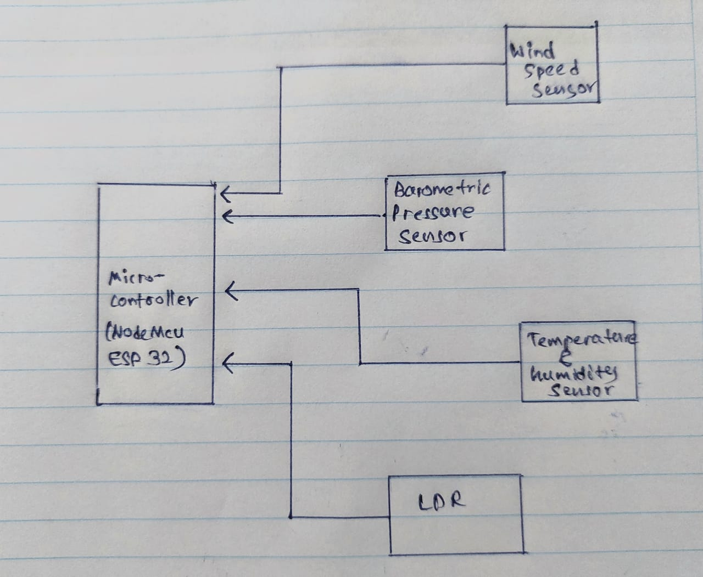
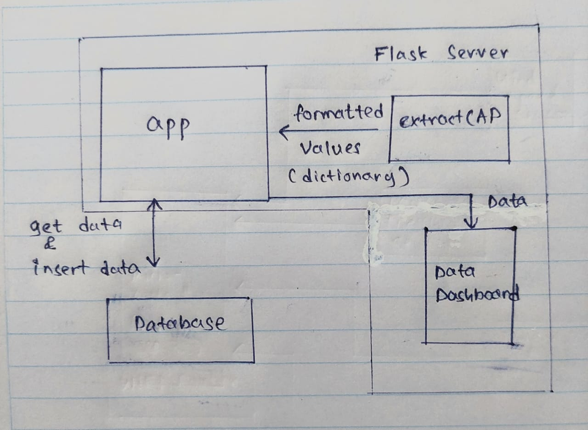
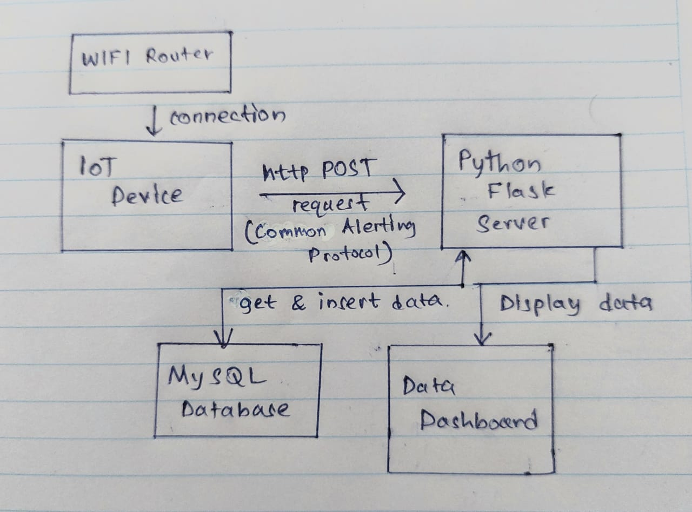

# Microcontroller_Project

# Environmental Monitoring IoT Device

## Final Project Report

```
N.M. Abeynayake – 180003L
```
```
CS3242- Microcontrollers and
Applications
```

## Table of Content

## 1. Scope of the Project

## 2. Special features

## 3. High Level Design

## 3.1. Block Diagram – IoT Device

## 3.2. Server Design

## 3.3. Overall Design Diagram

## 4. List of components and their cost

## 5. Schematic Diagram

## 6. Fault Recovery Options

## 7. Algorithm used for device and server (Pseudo code)

## 8. Full Source Code

## References


## 1. Scope of the Project

The purpose of this project is to develop an IoT device to monitor temperature, humidity
barometric pressure, wind speed and ambient light level of an environment. A data logger server
application is included to monitor the environmental parameters that is sent by the IoT device.

The CAP (Common Alerting Protocol) is used to transmit data to the remote server and the
server is updated every 15 minutes from average and the standard deviation of the data over last
15 min.

Another consideration of this project is to operate the IoT device with low power and unreliable
conductivity because the device is placed in a remote place. The micro-controller that is used for
this device is NodeMCU ESP 32. While data is sent to the server for 15 to 15 minutes, deep sleep
mode is used to save the battery life.

Self-recovery feature is included to recover the system from power, or other types of transient
faults.

The data that are taken by the server can be viewed from the dashboard.

```
Figure 1 – data dashboard
```

## 2. Special features

### Parameters

This device is capable of monitoring five parameters. Temperature, Wind Speed, Humidity,
Barometric Pressure and, Ambient light level. So, this device can read and handle extra
parameter. (Have to select only 4 )

### Power saving

Power saving is a special consideration of this device. Because this is an IoT device so, it is not
practical to operate if it does not contain any power saving method.

I have included a power saving feature to this project.

MOSFETs are added to control power to the sensors. For each 3 minutes, power down the
sensors and ESP 32 goes into deep sleep mode. After 3 minutes, ESP 32 wake up and power up
sensors and then, read values. Then values are saved to EEPROM.

After 15 minutes, the last five value sets that are saved in EEPROM are got back and calculated
the average and the standard deviation of that value sets, and send to the server.

The deep sleep mode in the ESP32 is not use without having a mechanism to power up and
power down sensors while the ESP32 in the deep sleep mode. Because sensors consume power
while the ESP32 is in the deep sleep mode. So, that’s why MOSFETs are included to control
power to the sensors.


## 3. High Level Design

3.1. Block Diagram – IoT Device

```
Figure – Block diagram of the IoT device
```
### 3.2. Server Design

```
Figure – Server Design
```

### 3.3. Overall Design Diagram

```
Figure- Overall Design Diagram
```

## 4. List of components and their cost

```
Name Number of components Cost (per each) Reference (see
last page)
```
```
NodeMCU ESP- 32 1 Rs. 1350 [1]
```
```
Wind Speed Sensor 1 $44.95 [2]
```
```
DHT22 Temperature
and humidity sensor
module
```
```
1 Rs. 930 [3]
```
```
LDR (RE0154) 1 Rs. 10 [4]
```
```
2N7000 MOSFET 1 Rs. 12 [5]
```
```
BMP280 Barometric
Pressure Sensor
```
```
1 Rs. 330 [6]
```

## 5. Schematic Diagram

```
Figure – Schematic Diagram
```
```
*a clear picture of the diagram added to the project folder as well.
```

## 6. Fault Recovery Options

This project contains a special self-recovery mechanism to recover from power failures or
connection failures.

According to my method, for each 3 minutes, power down the sensors and ESP 32 goes into deep
sleep mode. After 3 minutes, ESP 32 wake up and power up sensors and then, read values. Then
values are saved to EEPROM.

After 15 minutes, the last five value sets that are saved in EEPROM are got back and calculated
the average and the standard deviation of that value sets and send them.

So, if there is a network failure or power failure, it does no harm to this process. After
connection established, microcontroller checks whether it completed 15 minutes, if it completed,
then get last five set of data from the EEPROM and send. If it does not complete 15 - minute
cycle, it will continue the cycle without any error. (Check the algorithm for more details)

Because there is no data lost due to power failure or any other connection failure. Always
getting last saved data, then calculate the average and standard deviation, then send to the server.

```
Figure – write and read data from EEPROM
```

## 7. Algorithm used for device and server (Pseudo code)

### 7.1. Algorithm used to device to send data to the server

StartSensors();
sensorValues <- readValuesFromTheSensors()
WriteSensorReadingsTOEEPROM (id, sensorValues)

if After 15 Minutes from last time:

if Connected to wifi :

lastTempSensorValueArray = getTemperatureValuesFromEEPROM()
lastPressureSensorValueArray = getPressureValuesFromEEPROM()
lastHumiditySensorValueArray = getHumidityValuesFromEEPROM()
lastWindSpeedSensorValueArray = getWindSpeedValuesFromEEPROM()
lastLightLevelSensorValueArray = getLightLevelValuesFromEEPROM()

AverageValues = GetAvarageValuesFromArrays()
STDValues = GetStandardDeviationValuesFromArrays()

CAPString = Convet_TO_CAP_Format(AverageValues, STDValues)

response = sendDataTotheServer(CAPString)

if response is error:

showErrorInTheSerial()

end if

else:

showErrorInTheSerial()

end if

CommitDataTOEEPROM()
PowerOFFSensors()
Set3MinTimetoWakeUP()
StartESPDeepSleep()


### 7.2. Algorithm in the server

if post request to /add route:
data_in_the_reqbody = request.data
get_extracted_data = format_data_in_the_request_body(data_in_the_reqbody) // send
dictionary of values with their name
response = insert_values_from_the_microcontroller_to_database(get_extracted_data) //
extracted values send to the database (run sql query)
if response is error:
showError()
else:
showSuccessMessage()
end if

if get request to the server /dataTable route:
data = fetch_data_from_the_database() // fetch data from the database
ShowDataInTheTable(data) // as a html page

end if


## 8. Full Source Code

## Source code is submitted with the report.

## GitHub repository:

## https://github.com/nuwanuom18/Microcontroller_Project


## References

[1] https://tronic.lk/product/nodemcu-esp-32s-wifi-bluetooth-dual-mode-iot-dev-board

[2] https://www.adafruit.com/product/

[3] https://tronic.lk/product/dht22-am2302-digital-temperature-and-humidity-sensor-mo

[4] https://tronic.lk/product/ldr-4mm

[5] https://tronic.lk/product/2n7000-small-signal-mosfet-60v-200ma

[6] https://scionelectronics.com/product/bmp280-barometric-pressure-sensor-module/


